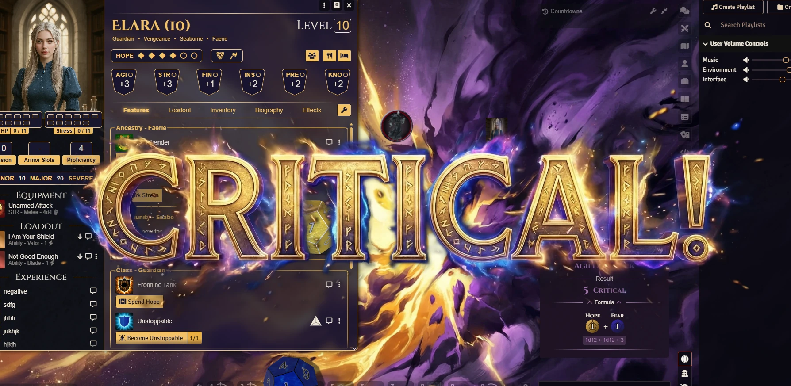
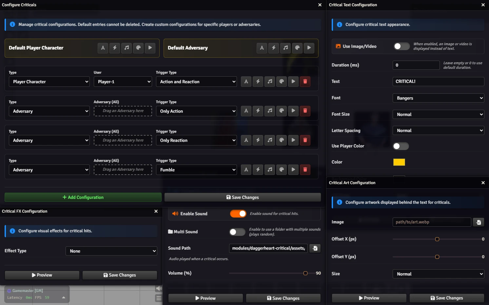

# 💥 Critical 💥

## for Daggerheart

<p align="center"></p>

<p align="center"></p>

Watch a video demo: [Youtube](https://youtu.be/y5GEFZrrJ58)

## Make Every Critical Legendary

Don't let a massive success be just another line of text. **Critical** transforms your Daggerheart sessions with visceral screen effects and cinematic audio. Feel the weight of every Hope & Fear match and every Adversary crit.

### ✨ Features

*   **Visual Impact:** From shattering glass to pulsing energy borders, the screen reacts to the drama of the dice.
*   **Dynamic Audio:** Heroic fanfares for players and terrifying stings for the GM.
*   **Smart Triggers:** Automatically detects Duality Dice matches (Players) and d20 crits (GM).
*   **Total Customization:** Change animations, sounds, colors, and fonts to match your table's vibe.
*   **Per-Player Settings:** Tailor the experience so every player feels unique.

## 🚀 Installation

Install via the Foundry VTT Module browser or use this manifest link:

```js
https://raw.githubusercontent.com/brunocalado/daggerheart-critical/refs/heads/main/module.json
```

## ⚖️ Credits & License

* **Code License:** GNU GPLv3.

* **Assets:** AI images provided are [CC0 1.0 Universal Public Domain](https://creativecommons.org/publicdomain/zero/1.0/).

* **sfx-critical:** [https://pixabay.com/service/license-summary/](https://pixabay.com/service/license-summary/)

* **Font Modification Notice:** The font files included in this module have been modified from their original Source form. Specifically, the original TrueType Font (.ttf) files were compressed and converted to Web Open Font Format 2 (.woff2) to optimize performance and reduce loading times within the Foundry VTT environment. All original copyright, trademark, and attribution notices have been retained.

* **License Files:** [licenses](https://github.com/brunocalado/daggerheart-critical/tree/main/docs/licenses)

**Disclaimer:** This module is an independent creation and is not affiliated with Darrington Press.

# 🧰 My Daggerheart Modules

| Module | Description |
| :--- | :--- |
| 💀 [**Adversary Manager**](https://github.com/brunocalado/daggerheart-advmanager) | Scale adversaries instantly and build balanced encounters in Foundry VTT. |
| ☠️ [**Death Moves**](https://github.com/brunocalado/daggerheart-death-moves) | Enhances the Death Move moment with immersive audio and visual effects. |
| 📏 [**Distances**](https://github.com/brunocalado/daggerheart-distances) | Visualizes combat ranges with customizable rings and hover calculations. |
| 🤖 [**Fear Macros**](https://github.com/brunocalado/daggerheart-fear-macros) | Automatically executes macros when the Fear resource is changed. |
| 😱 [**Fear Tracker**](https://github.com/brunocalado/daggerheart-fear-tracker) | Adds an animated slider bar with configurable fear tokens to the UI. |
| 🎲 [**Stats**](https://github.com/brunocalado/daggerheart-stats) | Tracks dice rolls from GM and Players. |
| 🧠 [**Stats Toolbox**](https://github.com/brunocalado/dh-statblock-importer) | Import using a statblock. |
| 🛒 [**Store**](https://github.com/brunocalado/daggerheart-store) | A dynamic, interactive, and fully configurable store for Foundry VTT. |
| 📦 [**Extra Content**](https://github.com/brunocalado/daggerheart-extra-content) | Homebrew for Daggerheart. |
| ⚡ [**Quick Actions**](https://github.com/brunocalado/daggerheart-quickactions) | Quick access to common mechanics like Falling Damage, Downtime, etc. |
| 📜 [**Quick Rules**](https://github.com/brunocalado/daggerheart-quickrules) | Fast and accessible reference guide for the core rules. |

# 🗺️ Adventures

| Adventure | Description |
| :--- | :--- |
| ✨ [**I Wish**](https://github.com/brunocalado/i-wish-daggerheart-adventure) | A wealthy merchant is cursed; one final expedition may be the only hope. |
| 💣 [**Suicide Squad**](https://github.com/brunocalado/suicide-squad-daggerheart-adventure) | Criminals forced to serve a ruthless master in a land on the brink of war. |