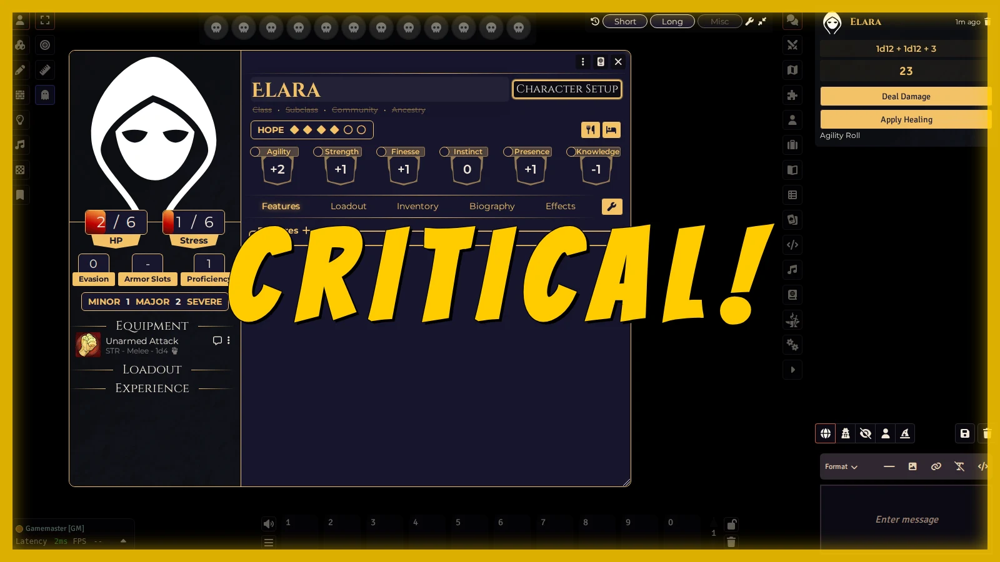
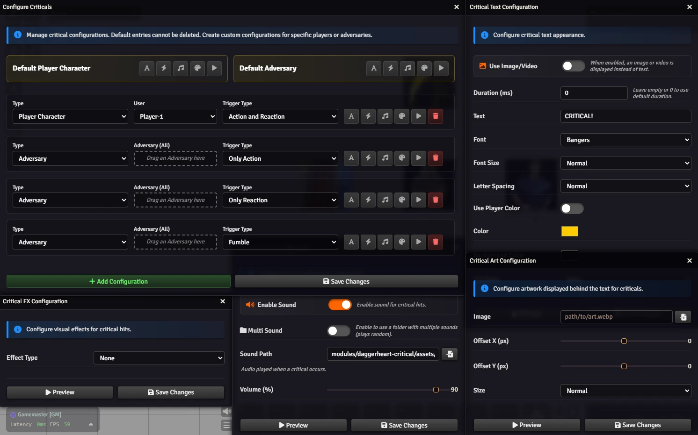

# 💥 Critical 💥

## for Daggerheart

Don't let a massive success be just another line of text. **Critical** transforms your Daggerheart sessions with visceral screen effects and cinematic audio. Feel the weight of every Hope & Fear match and every Adversary crit.

<p align="center"></p>

<p align="center"></p>

Watch a video demo: [Youtube](https://youtu.be/y5GEFZrrJ58)

[](https://buymeacoffee.com/mestredigital) [](https://mestredigital.online/pages/projetos-en)


## Make Every Critical Legendary

### ✨ Features

*   **Visual Impact:** From shattering glass to pulsing energy borders, the screen reacts to the drama of the dice.
*   **Dynamic Audio:** Heroic fanfares for players and terrifying stings for the GM.
*   **Smart Triggers:** Automatically detects Duality Dice matches (Players) and d20 crits (GM).
*   **Level Up Celebrations:** Trigger animations when player characters gain a level.
*   **Total Customization:** Change animations, sounds, colors, and fonts to match your table's vibe.
*   **Per-Player Settings:** Tailor the experience so every player feels unique.

## 🚀 Installation

Install via the Foundry VTT Module browser or use this manifest link:

```js
https://raw.githubusercontent.com/brunocalado/daggerheart-critical/refs/heads/main/module.json
```

## ⚖️ Credits & License

* **Code License:** GNU GPLv3.

* **sfx-critical:** [https://pixabay.com/service/license-summary/](https://pixabay.com/service/license-summary/)

* **Font Modification Notice:** The font files included in this module have been modified from their original Source form. Specifically, the original TrueType Font (.ttf) files were compressed and converted to Web Open Font Format 2 (.woff2) to optimize performance and reduce loading times within the Foundry VTT environment. All original copyright, trademark, and attribution notices have been retained.

* **License Files:** [licenses](https://github.com/brunocalado/daggerheart-critical/tree/main/docs/licenses)

**Disclaimer:** This module is an independent creation and is not affiliated with Darrington Press.

# 🧰 My Daggerheart Modules

| Module | Description |
| :--- | :--- |
| 💀 [**Adversary Manager**](https://github.com/brunocalado/daggerheart-advmanager) | Scale adversaries instantly and build balanced encounters. |
| 🖼️ [**Art Mapper**](https://github.com/brunocalado/dh-assets) | Automatically assigns artwork to system compendiums, actors, tokens, and custom module content — keeping your visuals organized and up to date. |
| 🐉 [**Colossus**](https://github.com/brunocalado/dh-colossus) | Manage massive multi-part boss encounters with independent HP per part and a single shared stress pool. |
| 📦 [**Containers**](https://github.com/brunocalado/dh-containers) | Group inventory items into collapsible containers — pouches, chests, backpacks — to declutter character sheets. |
| 💥 [**Critical**](https://github.com/brunocalado/daggerheart-critical) | Animated criticals. |
| 💠 [**Custom Stat Tracker**](https://github.com/brunocalado/dh-new-stat-tracker) | Add custom trackers to actors. |
| ☠️ [**Death Moves**](https://github.com/brunocalado/daggerheart-death-moves) | Enhances the Death Move moment with a dramatic interface and full automation. |
| 📏 [**Distances**](https://github.com/brunocalado/daggerheart-distances) | Visualizes combat ranges with customizable rings and hover calculations. |
| 📦 [**Extra Content**](https://github.com/brunocalado/daggerheart-extra-content) | Homebrew content pack. |
| 😱 [**Fear Tracker**](https://github.com/brunocalado/daggerheart-fear-tracker) | Adds an animated slider bar with configurable fear tokens to the UI. |
| 🧟 [**Horde**](https://github.com/brunocalado/dh-horde) | Explode single horde tokens into dozens of individual tokens and manage their movement and stats automatically. |
| 🎁 [**Mystery Box**](https://github.com/brunocalado/dh-mystery-box) | Introduces mystery box mechanics for random loot and surprises. |
| ⚡ [**Quick Actions**](https://github.com/brunocalado/daggerheart-quickactions) | Quick access to common mechanics like Falling Damage, Downtime, etc. |
| 📜 [**Quick Rules**](https://github.com/brunocalado/daggerheart-quickrules) | Fast and accessible reference guide for the core rules. |
| 🤖 [**Resource Macros**](https://github.com/brunocalado/daggerheart-fear-macros) | Automatically executes macros when the Fear, Hope, Stress, HP, or Armor resources change. |
| 🎲 [**Stats**](https://github.com/brunocalado/daggerheart-stats) | Tracks dice rolls from GM and Players. |
| 🧠 [**Stats Toolbox**](https://github.com/brunocalado/dh-statblock-importer) | Import actors using a statblock. |
| 🛒 [**Store**](https://github.com/brunocalado/daggerheart-store) | A dynamic, interactive, and fully configurable in-game store. |
| 🔍 [**Unidentified**](https://github.com/brunocalado/dh-unidentified) | Obfuscates item names and descriptions until they are identified by the players. |
| 🌌 [**Void**](https://github.com/brunocalado/the-void-unofficial) | Unofficial module that brings The Void playtesting content — experimental classes, subclasses, ancestries, communities, adversaries, loot, weapons, and more. |

# 🗺️ Adventures

| Adventure | Description |
| :--- | :--- |
| ✨ [**I Wish**](https://github.com/brunocalado/i-wish-daggerheart-adventure) | A wealthy merchant is cursed; one final expedition may be the only hope. |
| 💣 [**Suicide Squad**](https://github.com/brunocalado/suicide-squad-daggerheart-adventure) | Criminals forced to serve a ruthless master in a land on the brink of war. |